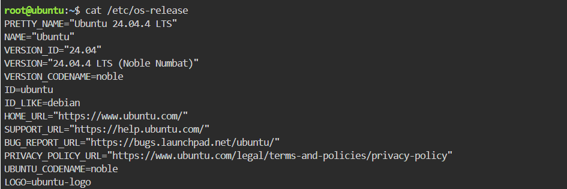
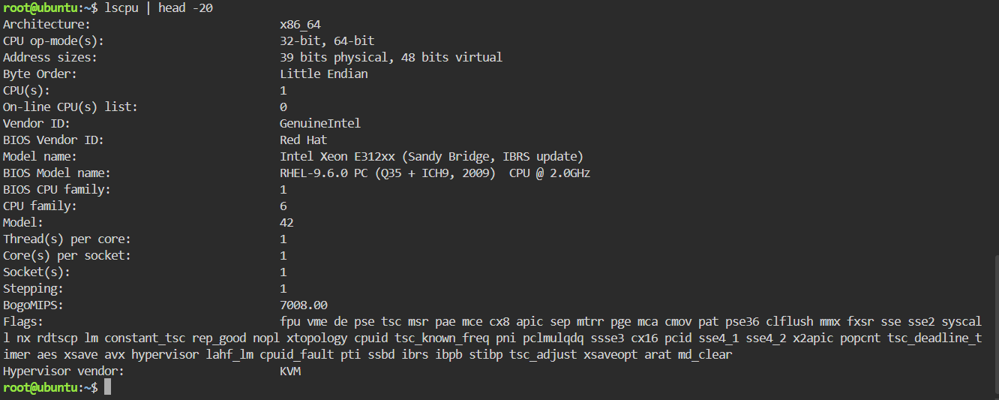
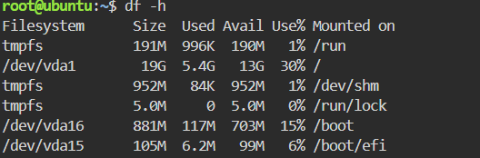

# Laboratory 03 – Multi-Cloud Explorer

## Mission Overview

This laboratory explores three major public cloud platforms: Amazon Web Services (AWS), Microsoft Azure, and Google Cloud Platform (GCP). The activities involve researching cloud services, comparing providers, analyzing business requirements, and recommending appropriate cloud platforms.

## Linux Server Investigation

A Linux server was investigated using the KillerCoda Playground. The following Linux commands were used to collect information about the operating system, CPU, memory, and disk space.

### Operating System

Command used:

```bash
cat /etc/os-release
```

The command displays information about the Linux distribution, version, and operating system.



### CPU Information

Command used:

```bash
lscpu
```

The command displays CPU architecture, processor information, number of CPUs, and other processor specifications.



### Memory

Command used:

```bash
free -h
```

The command displays the total, used, available, and other memory information in a human-readable format.


### Disk Space

Command used:

```bash
df -h
```

The command displays available disk space and storage usage for mounted filesystems.



## Cloud Hosting Options

If this Linux server were migrated to the cloud, equivalent virtual machine services could be used on each major cloud platform.

| Cloud Provider  | Service That Could Host the Linux Server |
| --------------- | ---------------------------------------- |
| AWS             | Amazon EC2                               |
| Microsoft Azure | Azure Virtual Machines                   |
| Google Cloud    | Compute Engine                           |

### AWS – Amazon EC2

Amazon EC2 could host the Linux server as a virtual machine in AWS. The server's operating system and computing resources could be configured according to the application's requirements.

### Microsoft Azure – Azure Virtual Machines

Azure Virtual Machines could host the Linux server in Microsoft Azure. Azure supports Linux virtual machines and provides configurable computing resources for different workloads.

### Google Cloud – Compute Engine

Google Compute Engine could host the Linux server as a virtual machine in Google Cloud. The service allows organizations to configure virtual machines with different CPU, memory, storage, and operating system options.

## Conclusion

The Linux investigation demonstrated how basic command-line tools can be used to identify important server resources. These resources can be mapped to cloud virtual machine services such as Amazon EC2, Azure Virtual Machines, and Google Compute Engine when migrating a Linux workload to the cloud.
