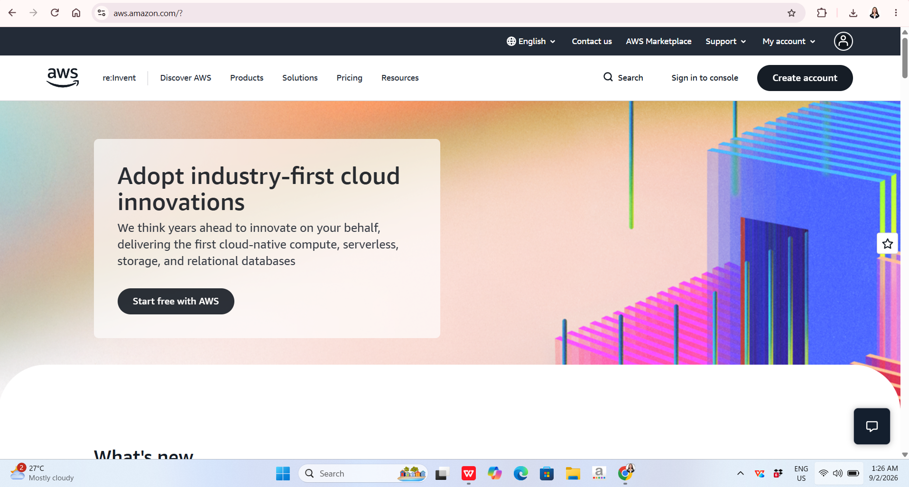

# AWS Research

## Brief Overview

Amazon Web Services (AWS) is a cloud computing platform that provides a wide range of infrastructure, storage, database, networking, security, analytics, and application services. AWS allows organizations to use computing resources over the internet without having to purchase and maintain all of the physical infrastructure themselves. Its services can support applications ranging from small projects to large enterprise systems.

## Global Infrastructure

AWS operates a global infrastructure organized into geographic Regions and Availability Zones. An AWS Region is a separate geographic area, while Availability Zones are isolated locations within a Region. AWS explains that its Availability Zones are connected through high-bandwidth, low-latency networking, allowing organizations to design applications for high availability and fault tolerance. AWS currently lists infrastructure across regions in North America, South America, Europe, Asia Pacific, Africa, the Middle East, and other geographic areas.

## Cloud Management Console

The AWS Management Console is a web-based interface used to access and manage AWS services. Through the console, users can create and configure resources, monitor services, manage security settings, and control their cloud infrastructure. It provides a centralized interface for working with AWS services without requiring users to perform every task through command-line tools.

## Four Core Services

### 1. Amazon EC2

Amazon Elastic Compute Cloud (EC2) provides resizable virtual computing capacity in the AWS Cloud. Organizations can launch virtual servers and select different configurations according to their application requirements.

### 2. Amazon S3

Amazon Simple Storage Service (S3) provides object storage for storing and retrieving data. It can be used for documents, backups, application files, media, and other types of data.

### 3. Amazon VPC

Amazon Virtual Private Cloud (VPC) allows users to create a logically isolated virtual network within AWS. It provides control over networking components such as subnets, routing, and network security.

### 4. AWS Identity and Access Management (IAM)

AWS IAM is used to manage access to AWS resources. Organizations can create users, roles, and permissions to control who can access particular cloud resources and what actions they can perform.

## Three Advantages

1. **Broad Service Selection** – AWS provides a large portfolio of cloud services that can support computing, storage, databases, networking, analytics, security, and application development.

2. **Global Infrastructure** – AWS provides Regions and Availability Zones across many geographic areas, allowing organizations to deploy applications closer to their users and design highly available systems.

3. **Scalability** – AWS resources can be increased or decreased according to workload requirements, helping organizations respond to changes in demand.

## Typical Enterprise Use Cases

AWS can be used by enterprises for web and mobile application hosting, data storage and backup, enterprise databases, disaster recovery, analytics, content delivery, and large-scale application deployment. Its global infrastructure and broad service portfolio make it suitable for organizations with different technical and business requirements.

## Screenshot

*Figure 1. AWS official website or management console.*
