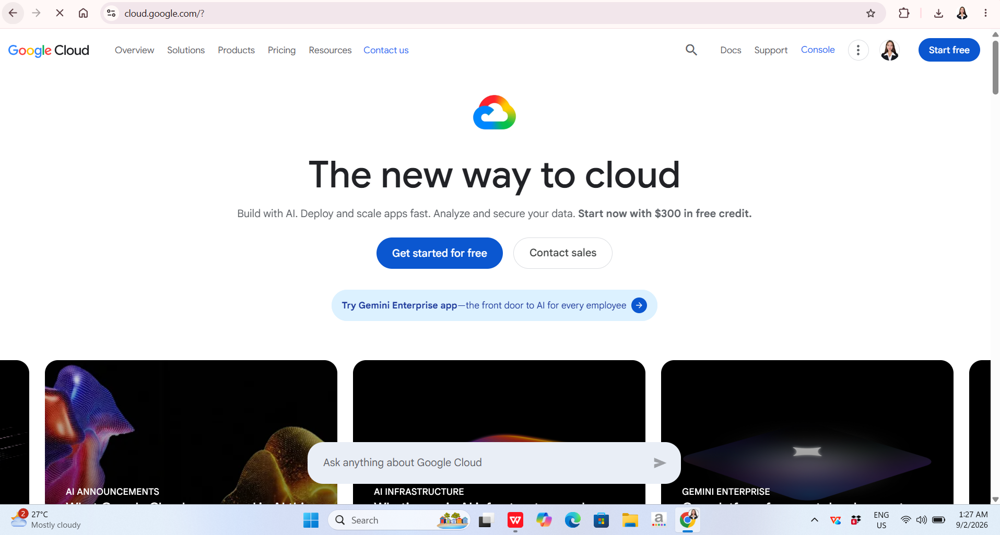

# Google Cloud Platform Research

## Brief Overview

Google Cloud is a public cloud computing platform operated by Google. It provides infrastructure and platform services for computing, storage, networking, databases, analytics, artificial intelligence, machine learning, application development, and containerized applications. Google Cloud allows organizations to deploy workloads using Google's global infrastructure and technology.

## Global Infrastructure

Google Cloud organizes its infrastructure into regions and zones. A region is a geographic area, while zones are locations within regions where resources such as Compute Engine instances can operate. Google Cloud currently provides infrastructure across multiple continents and allows organizations to deploy workloads in different locations to improve performance, availability, and resilience.

## Cloud Management Console

The Google Cloud console is a web-based interface for managing Google Cloud resources and services. Users can create and manage projects, virtual machines, storage resources, networks, databases, Kubernetes environments, and other services through the console.

## Four Core Services

### 1. Compute Engine

Compute Engine is Google Cloud's Infrastructure-as-a-Service offering for creating and running virtual machines. It supports Linux and Windows workloads and provides configurable computing resources for different applications.

### 2. Cloud Storage

Cloud Storage provides object storage for storing and retrieving data. It can be used for application files, backups, media, datasets, and other types of unstructured information.

### 3. Virtual Private Cloud (VPC)

Google Cloud VPC provides networking capabilities for connecting and controlling cloud resources. It allows organizations to design networks for applications and workloads running in Google Cloud.

### 4. Identity and Access Management (IAM)

Google Cloud IAM allows organizations to control which users, groups, and service accounts can access cloud resources. Permissions are assigned through roles, allowing organizations to apply access controls based on specific requirements.

## Three Advantages

1. **Strong AI and Machine Learning Capabilities** – Google Cloud provides infrastructure and services designed for artificial intelligence and machine learning workloads, including specialized computing resources.

2. **Kubernetes and Containers** – Google Cloud provides Google Kubernetes Engine (GKE), a managed Kubernetes service for deploying and managing containerized applications.

3. **Google Global Network** – Google Cloud uses Google's global infrastructure and network to support applications that require global connectivity, performance, and scalability.

## Typical Enterprise Use Cases

Google Cloud can be used for artificial intelligence and machine learning, data analytics, web application hosting, containerized applications, Kubernetes deployments, database systems, and large-scale data processing. Its services are particularly useful for organizations that work heavily with data, AI, machine learning, and modern container-based applications.

## Screenshot

*Figure 3. Google Cloud official website or management console.*
